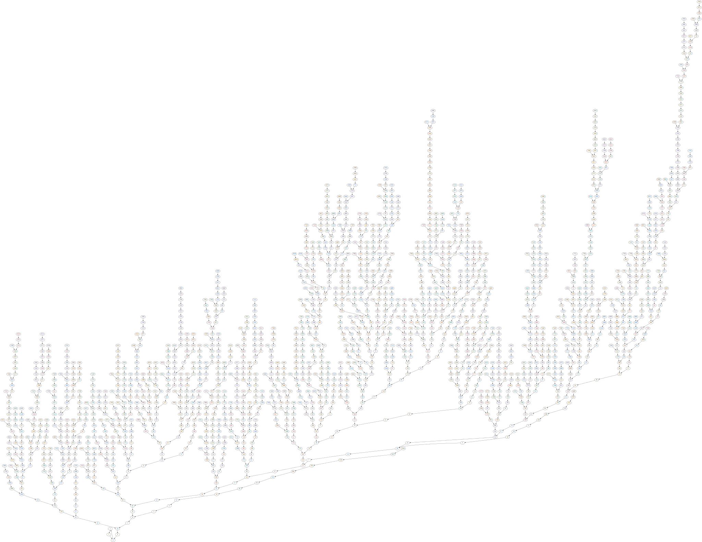

# Collatz Visualisation

A visualisation of the [Collatz Conjecture](https://en.wikipedia.org/wiki/Collatz_Conjecture)

- Numbers are capped at 8192
- All Numbers up to and including 26 are included in this tree*

- Numbers are capped at 16384
- All numbers up to and including 446 are included in this tree*

* these are not technically trees because of the loop 1-2-4-1
